devtools-snippets
=================

A collection of helpful snippets to use inside of browser devtools.

View them all on a single page: http://bgrins.github.io/devtools-snippets/ or all of them [inside of github](https://github.com/bgrins/devtools-snippets/tree/master/snippets).  I have a [more long winded article about snippets](http://www.briangrinstead.com/blog/devtools-snippets) detailing why you might use them and additional features that would be nice, if you are interested.

If you have a useful snippet or updates to an existing one that you'd like to share, please contribute it or open an issue!  Feel free to use, modify, or share any of these snippets.

## To Enable DevTools Snippets in Chrome

*Note: snippets are enabled by default in Chrome Canary and will be usable without changing your settings soon. You can read more about [snippets at the Chrome developer tools documentation](https://developers.google.com/chrome-developer-tools/docs/authoring-development-workflow#snippets).*

* Open Chrome.
* Navigate to `chrome://flags` -> `Enable Developer Tools experiments`.
* Open Devtools -> `Settings` -> `Developer Tools Experiments` -> `Enable "Snippets support"`.
* Close and reopen devtools.
* Open "Sources" panel.
* Go to "Snippets" tab, and add whichever ones you want.

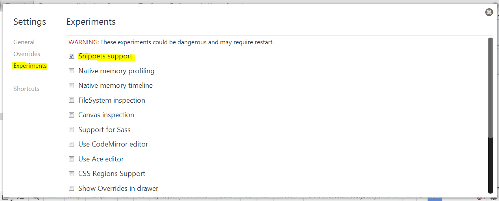

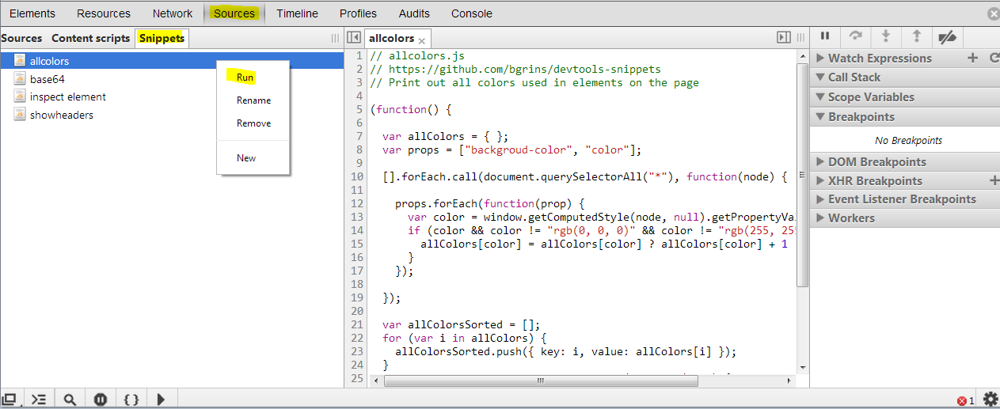

## To Use DevTools Snippets in Firefox Scratchpad

*Note: you can read more about [scratchpad at the  Firefox developers tools documentation](https://developer.mozilla.org/en-US/docs/Tools/Scratchpad).*

* Open Firefox.
* Go to `Tools` > `Web Developer` > `Scratchpad`.
* Copy/paste and Cmd-R / Ctrl-R to run.
* `File` > `Save`, then `File` > `Open Recent` to reuse them.

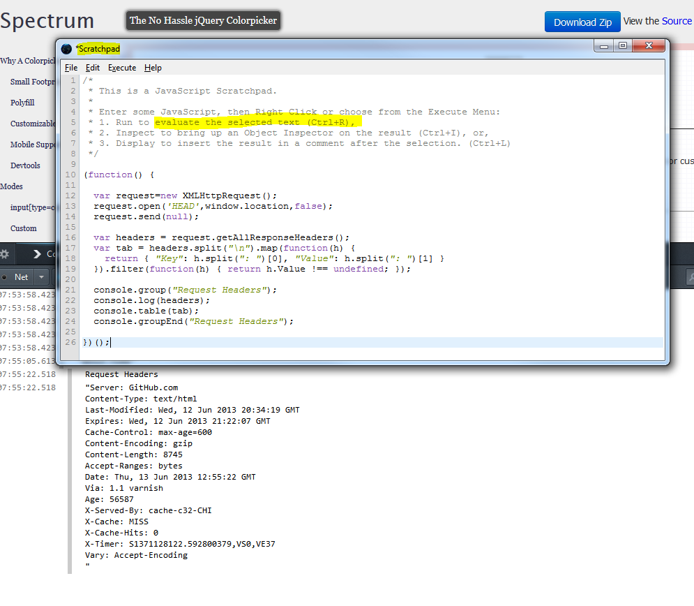

## Snippet screenshots

Or, view all on a single page with code: http://bgrins.github.io/devtools-snippets/

### jquerify.js
Includes jQuery onto a page if it is not yet included.

[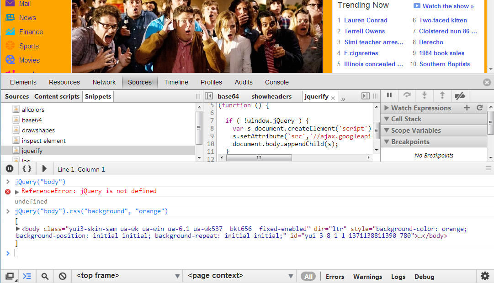](snippets/jquerify.js)

### log.js
Adds a `log` function to window object.

[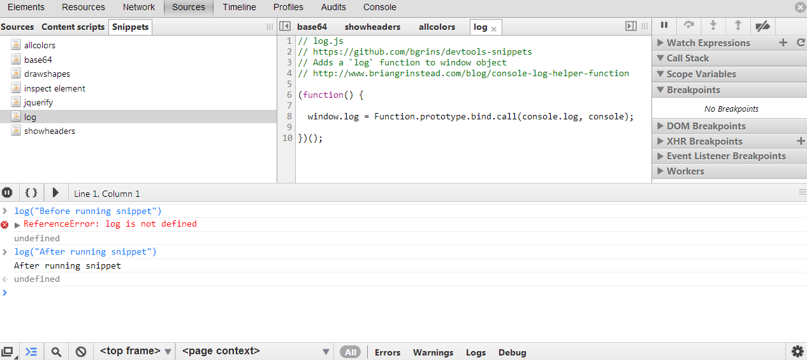](snippets/log.js)

### showheaders.js
Pretty prints the HTTP headers for the current page into the console.  *Uses console.table*.

[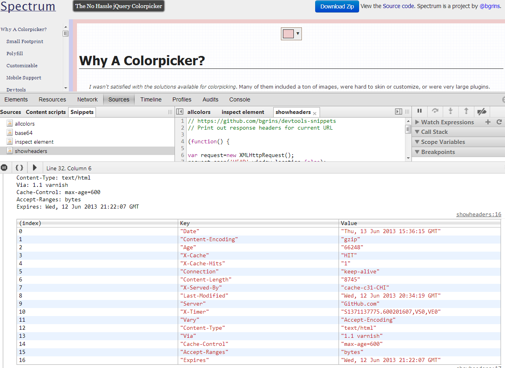](snippets/showheaders.js)

### dataurl.js
Convert all images on the page to data URLs.  *Note: this only works for images that are on the same domain as the current page*.

### allcolors.js
Print out all colors from computed styles used in elements on the page.  *Uses styled console.log calls to visualize each color*.

[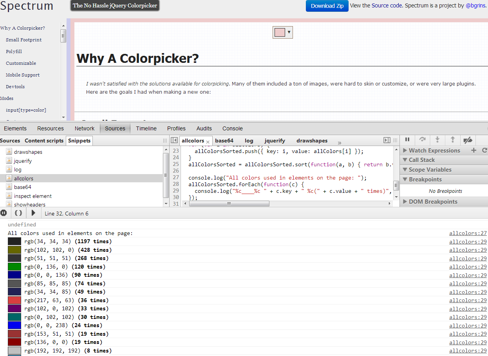](snippets/allcolors.js)

### performance.js
Print out information about the [window.performance object](https://developer.mozilla.org/en-US/docs/Navigation_timing).  *Uses console.table and grouping to organize the information*.

[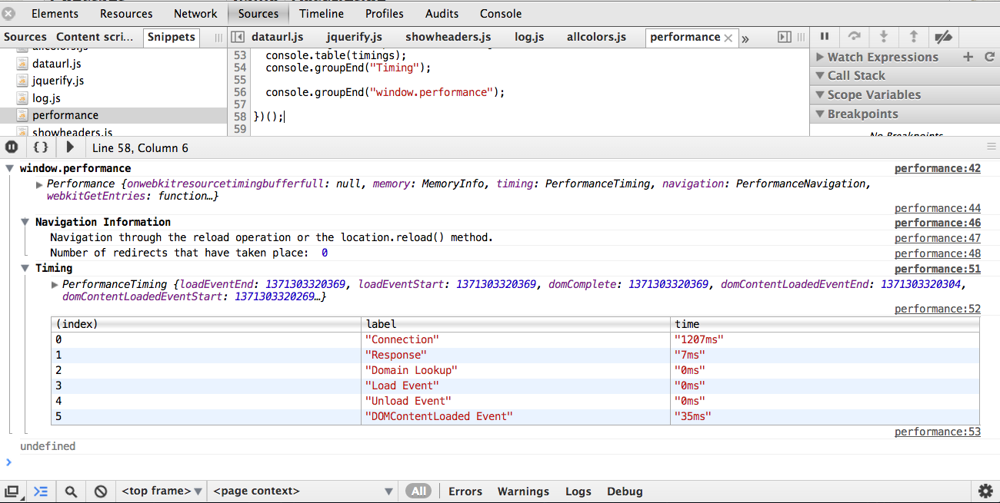](snippets/performance.js)

### cssprettifier.js

Script for unminifying and prettifying a CSS file written by [addyosmani](http://addyosmani.com) and [sindresorhus](http://sindresorhus.com). View the [cssprettifier-bookmarklet project on github](https://github.com/addyosmani/cssprettifier-bookmarklet).

[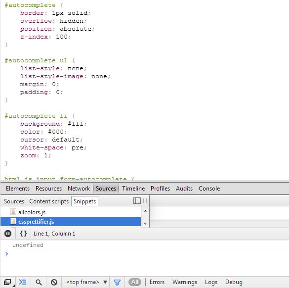](snippets/cssprettifier.js)

### hashlink.js

Handy way to find the closest linkable element on a page.  Run it, then click on an element, and it will give you the closest #link to that page.

[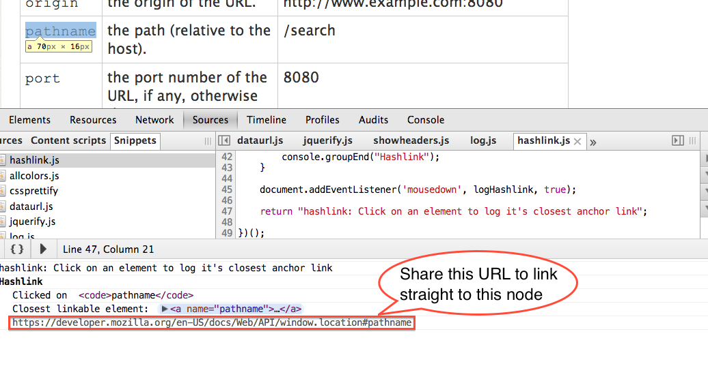](snippets/hashlink.js)

[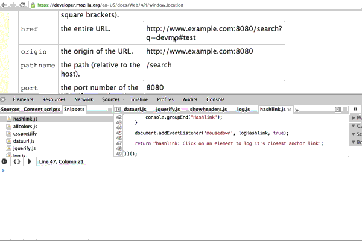](snippets/hashlink.js)

### querystringvalues.js

Print a table of query string (GET) values.  This can be helpful, especially when trying to read the values from a long or complicated URL that may otherwise need to be pasted into another editor to read.  Implementation by [mattpass](https://github.com/mattpass).

[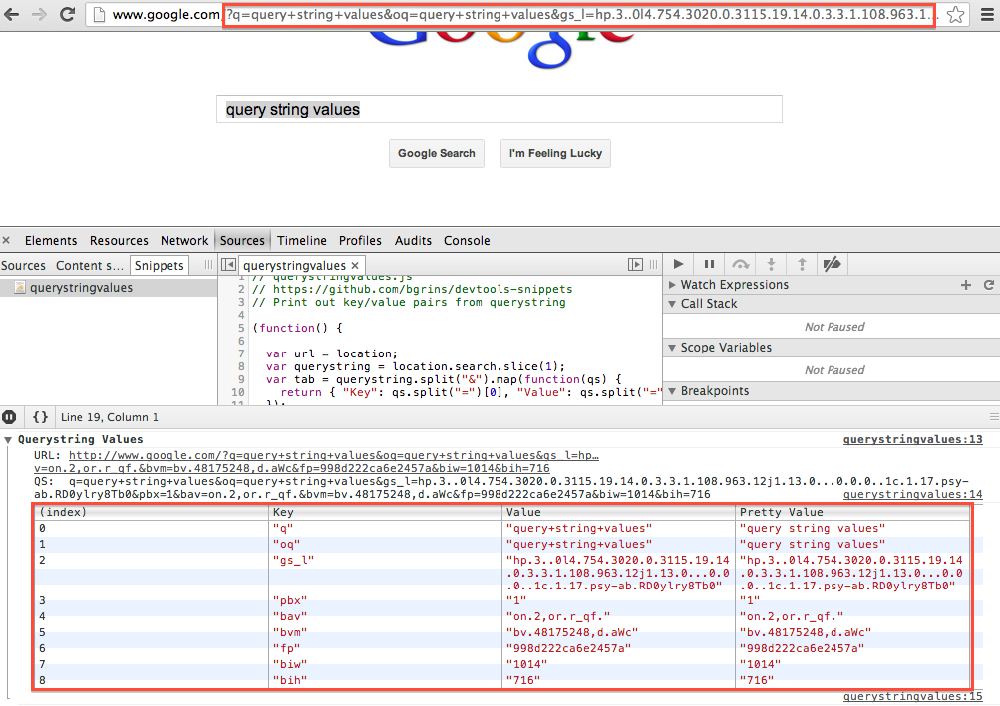](snippets/querystringvalues.js)

### wrapelement.js

 Exposes a window function `wrapElement(element, tag)`.  The first parameter is either a DOM Node, or a selector string, and the second parameter is the tag name for the wrapping element.  Implementation by [gkatsev](https://github.com/gkatsev).

[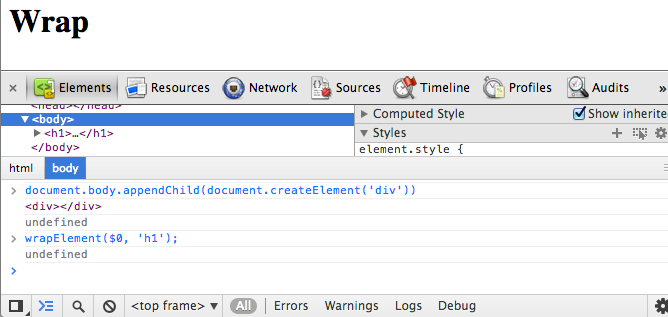](snippets/wrapelement.js)

### plainforms.js

 HTML5 Forms are great, but sometimes you don't want the browser to validate or present special controls for them. For instance, if you want to test server-side validation of some fields, you do not want the browser to prevent invalid data for that field type. This snippet finds all of the HTML5 input elements, sets their type attributes to "text" (and keeps any values that were set), and removes any validations enforced by the browser.  Implementation by [stroebjo](https://github.com/stroebjo).

### formcontrols.js

Shows all html form elements with their values and types in a nice table.  Adds a new table for each form on the page.  Implementation by [Kienz](https://github.com/Kienz).

### html_i18n_content.js

Generate downloadable files, based on location.href,
for [i18n](http://developer.chrome.com/extensions/i18n.html) of Chrome App or Extension:

* messages.json containing chrome.i18n messages (with placeholders) for element.innerText and input[value]
* location.href with i18n-content tags added (text and placeholders preserved to ease round-tripping changes)
* applyChromeI18nMessages.js to include in location.href to initialize localized messages on load

Implementation by [anaran](https://github.com/anaran).

[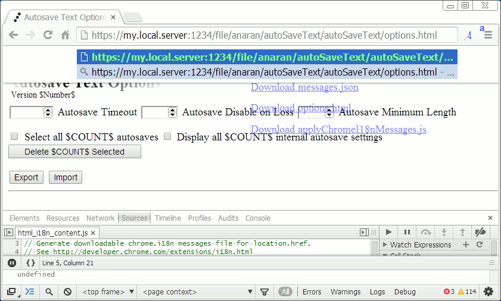](snippets/html_i18n_content.js)

