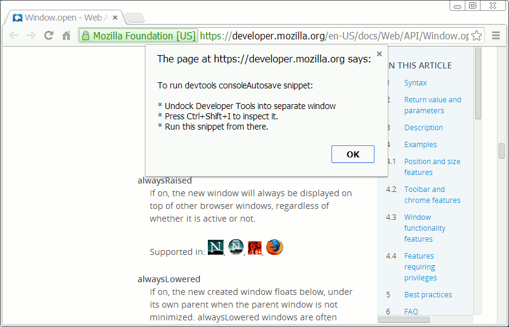

### consoleAutosave.js

### Developer Tools console messages autosave Snippet for Google Chrome

Source
-------

**Release** https://raw.github.com/bgrins/devtools-snippets/master/snippets/consoleAutosave/consoleAutosave.js

**Development** https://raw.github.com/anaran/devtools-snippets/consoleAutosave/snippets/consoleAutosave/consoleAutosave.js

Documentation
-------

**Release** http://bgrins.github.io/devtools-snippets/#consoleAutosave

**Development** https://github.com/anaran/devtools-snippets/blob/consoleAutosave/snippets/consoleAutosave/README.md

### Features

-  Enable an interval timer to save console messages (commands and output) in devtools localStorage

    - Messages are checked every 5 seconds
    - Messages are saved, along with a timestamp, whenever text content has grown by more than 20 characters

-  Download previously autosaved console messages

    - Whenever the snippet is run it checks for previous data in localStorage

        - Presents previous data, along with a timestamp, in a popup window
        - Provides a link in that popup window to download the autosaved data

Implementation by [anaran](https://github.com/anaran).

