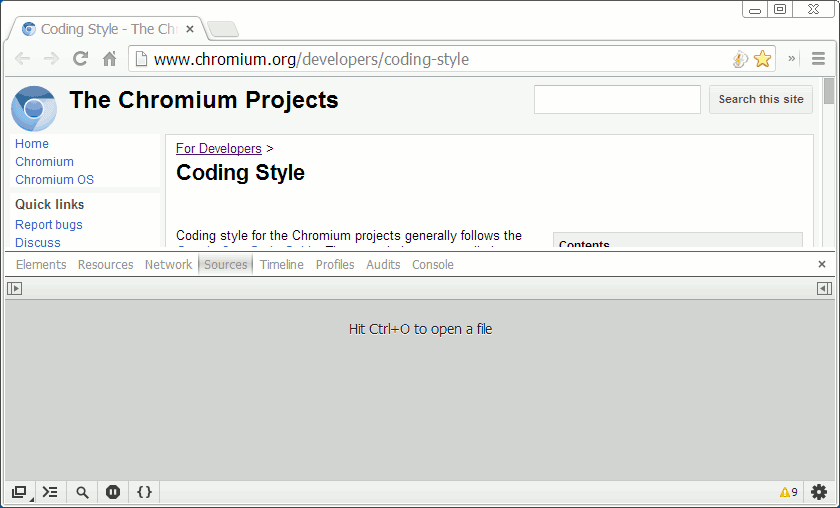

### devtools_import_export.js

### Developer Tools Import/Export Snippet for Google Chrome

**Source** https://raw.github.com/anaran/devtools-snippets/master/snippets/devtools_import_export.js

**Documentation** http://bgrins.github.io/devtools-snippets/#devtools_import_export

### Features

-  Export Chrome Developer Tools information to JSON

    - Source Snippets

    - Command History

    - localStorage

-  Import Source Snippets (from .js or JSON export) into Chrome Developer Tools

-  Export localStorage of websites to JSON

Implementation by [anaran](https://github.com/anaran).

[Typical Use Cases](#step-1)

## Typical Use Cases

* [Get devtools_import_export installed](#step-1)
* [Run devtools_import_export Snippet](#step-4)
* [Export website localStorage](#step-6)
* [Import Snippets indo Developer Tools](#step-7)
* [Show/Download Developer Tools Console Command History](#step-11)
* [Delete All Developer Tools Snippets](#step-12)

### Step 1

[end](#step-13) [forward](#step-2) [overview](#typical-use-cases)

Open Source Tab with `Ctrl+Shift+I` and `Ctrl+3`

![][dtie01]

### Step 2

[back](#step-1) [forward](#step-3) [overview](#typical-use-cases)

Add New snippet with Snippets tab context menu

![][dtie02]

### Step 3

[back](#step-2) [forward](#step-4) [overview](#typical-use-cases)

Accept the automatically generated snippet name

![][dtie03]

### Step 4

[back](#step-3) [forward](#step-5) [overview](#typical-use-cases)

Copy raw contents of the devtools_import_export.js snippet

![][dtie04]

### Step 5

[back](#step-4) [forward](#step-6) [overview](#typical-use-cases)

Choose to inspect the current webpage by clicking the "Open DevTools Import/Export" link

![][dtie05]

### Step 6

[back](#step-5) [forward](#step-7) [overview](#typical-use-cases)

Click the "Export All n localStorage Entries" if you like

![][dtie06]

### Step 7

[back](#step-6) [forward](#step-8) [overview](#typical-use-cases)

Undock devtools into separate window, press `Ctrl+Shift+I` `Ctrl+3` and select "Script snipper #109" and Run it

![][dtie07]

### Step 8

[back](#step-7) [forward](#step-9) [overview](#typical-use-cases)

A new tab, "DevTools Import/Export", opens. In addition to localStorage it also shows information about available console command history and snippets. Click "Import Snippets" and pick a previously saved export of localStorage.

![][dtie08]

### Step 9

[back](#step-8) [forward](#step-10) [overview](#typical-use-cases)

Pick a file from your downloads folder, named similar to, e.g. "localStorage_2013-11-01T130645.378Z.txt"

![][dtie09]

### Step 10

[back](#step-9) [forward](#step-11) [overview](#typical-use-cases)

"DevTools Import/Export" updates within 3 seconds to reflect the newly imported snippets available for export now.

![][dtie10]

### Step 11

[back](#step-10) [forward](#step-12) [overview](#typical-use-cases)

Click "Show All n Entries Console Command History" to see the last commands you used in the console for debugging.

![][dtie11]

### Step 12

[back](#step-11) [forward](#step-13) [overview](#typical-use-cases)

Click "Delete All n Snippets".

This will automatically perform `Delete All n locaStorage Entries` for you.

It will then ask you for confirmation you have acually verified the successful backup export of localStorage data containing snippets source code, among other information.

It will finally delete all snippets if you confirm with `OK`. You can still `Cancel` at this point.

![][dtie12]

### Step 13

[back](#step-12) [start](#step-1)

"DevTools Import/Export" updates within 3 seconds to confirm all snippets have been deleted, including the copy of devtools_import_export.js

![][dtie13]

[dtie01]: dtie01.png "We start out with no snippets installed, devtools docked to main window"
[dtie02]: dtie02.png "We still see no sources displayed"
[dtie03]: dtie03.png "The Source tab now displays the empty content of the new snippet, 'Script snipper #109'"
[dtie04]: dtie04.png "Open https://raw.github.com/anaran/devtools-snippets/master/snippets/devtools_import_export.js an chrome, copy and paste the contents to the snippet Source tab. Then press Ctrl+Enter or the |> button to 'Run snippet'"
[dtie05]: dtie05.png "A popup informs us of the two major use cases: 1. inspect the webpage, 2. import/export of devtools data (snippets, command history, localStorage)"
[dtie06]: dtie06.png "This is a handy way to save and inspect data saved in localStorage of the visited website."
[dtie07]: dtie07.png "The popup indicates we are about to inspect devtools information not specific to any website."
[dtie08]: dtie08.png "First you will have to click 'Export All n localStorage Entries' so that you can import something."
[dtie09]: dtie09.png "The relevant section of data from the saved localStorage will be used to import snippets. Alternatively you can also pick individual JavaScript files to import them as snippets. Any other files would import too, but might not be very useful."
[dtie10]: dtie10.png "Individual snippet files may also be downloaded now. Take note of the download settings advice. User confirmation is necessary for downloads of files with the .js extension."
[dtie11]: dtie11.png "This console history list is easily navigated and can be downloaded as a standalone .html file which features the same easy navigation of the history. The information is read-only, but can be copied or dragged to other editable areas."
[dtie12]: dtie12.png "Deleting all snippets can be useful when you keep them under version control outside chrome and you want to import a new set, e.g. after merging with exports from other browsers."
[dtie13]: dtie13.png "We are now back at the state at the beginning of this demo, except for changes to console history and other localStorage information you may have made."
