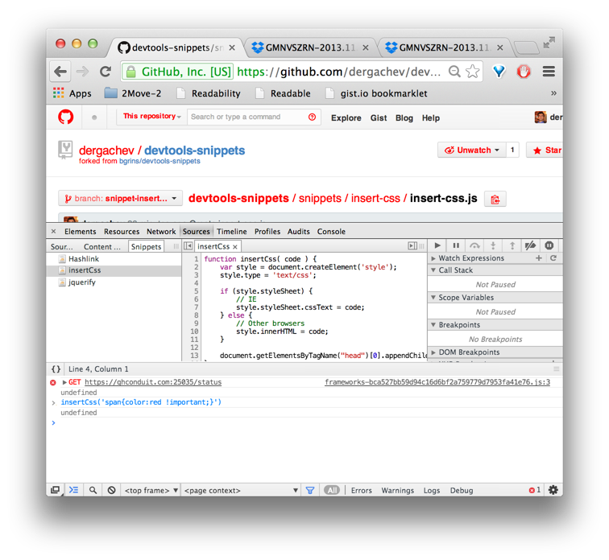

### insert-css.js

Defines `insertCss()` function which injects a snippet of CSS into the current page.  After running the snippet, you can call it as follows: `insertCss('span { color: red !important; }');`

