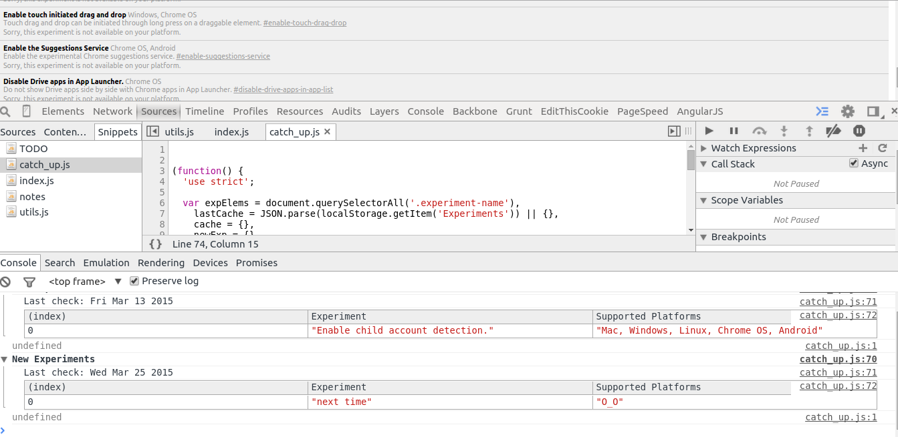

# new_experiments.js

Shows all new experiments in chrome://flags. It caches all
experiments in localstorage and then diffs past and current experiments, eventually
logs any new experiments. Checkout new experiments after updating chrome.

Implementation by [lestoni](https://github.com/lestoni).

