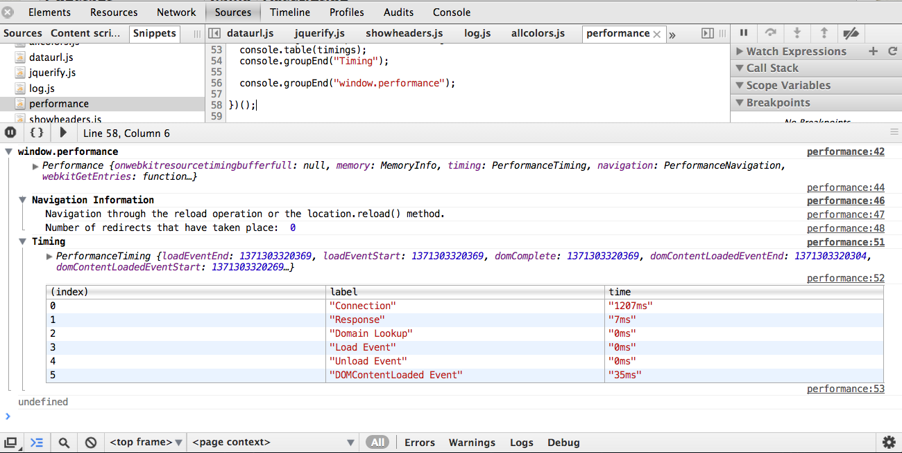

### performance.js

Print out information about the [window.performance object](https://developer.mozilla.org/en-US/docs/Navigation_timing).  *Uses console.table and grouping to organize the information*.

